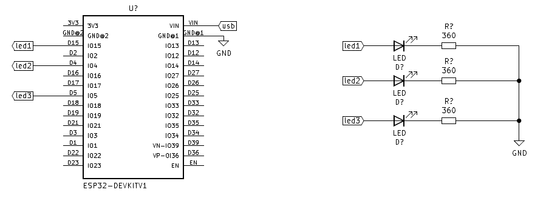

Um dos meus primeiros projetos com o ESP32, usa o código Arduíno no VS Code com a extensão PlatformIO,
um projeto simples mas que usa um conceito bastante interessante que será útil em projetos futuros que
usarão várias threads

Sempre que usamos uma função delay em qualquer microcontrolador, basicamente estamos colocando instruções
nop no processador, fazendo com que o processador "processe" essas instruções nop por determinado tempo
até atingirmos o tempo de delay. O ruim disso é que o processador fica ocupado realizando essas instruções
e não pode seguir na execução do código. 

Podemos "repartir" o tempo em que o processador está ocupado em cada tarefa usando a função millis()
uma função que mede o tempo de execução do processador em milisegundos, assim podemos separar quanto
tempo o processador ocupa realizando cada task.

Em Sistemas Operacionais como Windows e Linux, são usadas Threads para dividir o tempo de execução
do processador entre várias tasks, em microcontroladores potentes como o esp32 podemos usar o FREERTOS
para separar várias tasks para execução do processador que funções como a função millis para fazer
isso em baixo-nível.

Nesse simples programa, como queremos somente piscar três LEDs não precisamos de usar o FREERTOS,
vamos somente usar a função millis() manualmente. Basicamente temos três tasks a serem feitas, e 
cada uma é disparada no exato momento no tempo, assim não ocupando o processador o tempo todo de 
modo que cada task pode ser feita paralelamente.

